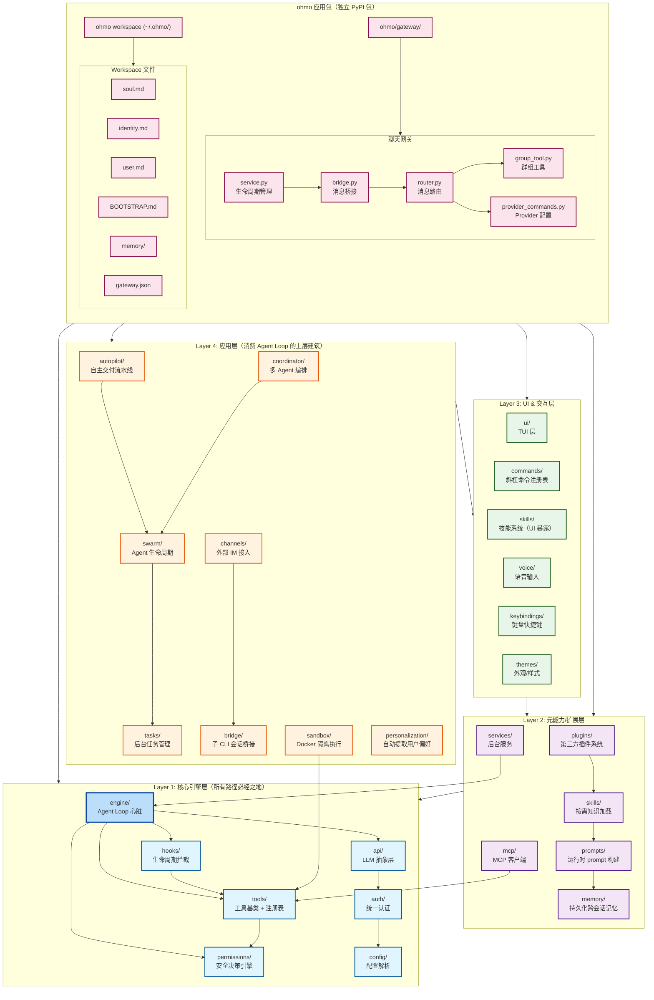
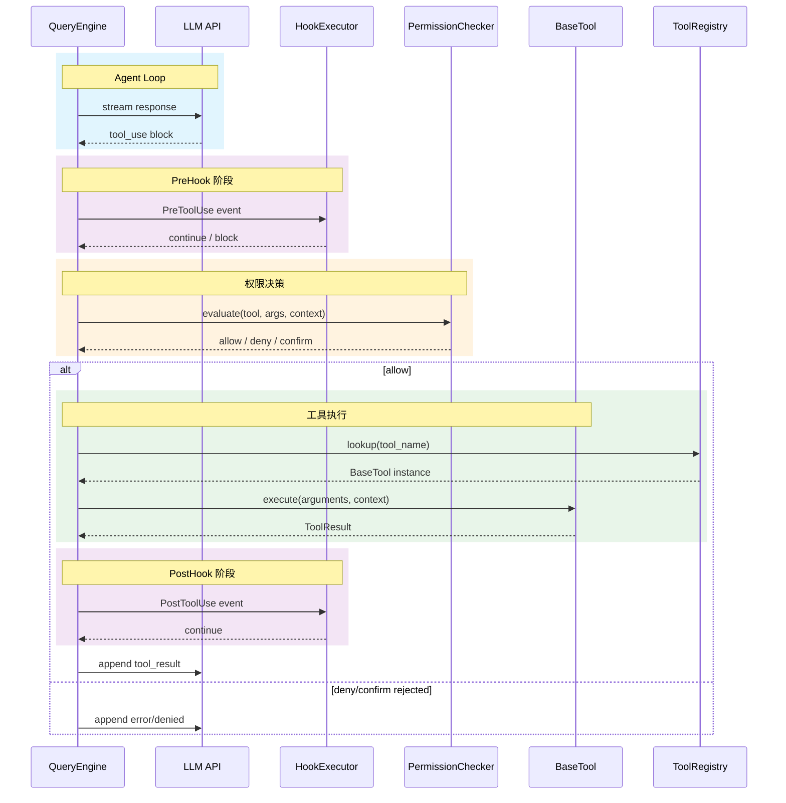
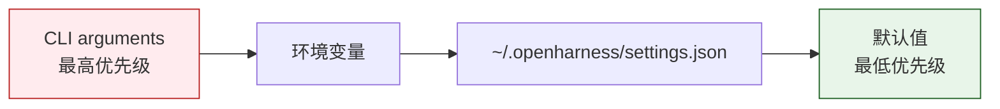
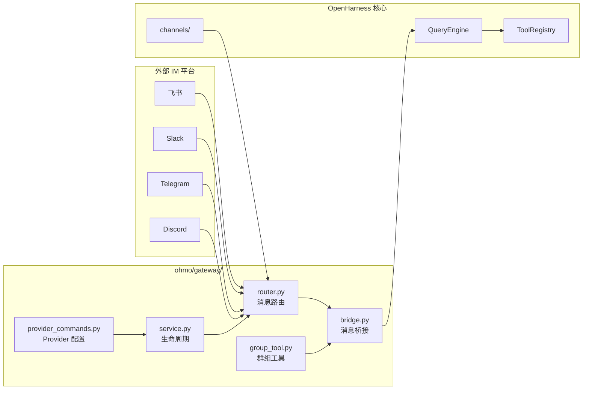

# OpenHarness 系统架构图

## 整体架构（四层 + ohmo 应用包）

## 核心引擎数据流（工具执行流水线）

## 配置解析优先级

## ohmo 网关架构

## 技术栈概览

| 层级 | 核心技术 | 关键类/模块 |
|------|---------|-----------|
| Layer 1 | Anthropic SDK, OpenAI SDK, Pydantic | `QueryEngine`, `BaseTool`, `PermissionChecker`, `HookExecutor` |
| Layer 2 | JSON Schema, MCP Protocol, Markdown | `PluginManager`, `McpClient`, `SkillLoader` |
| Layer 3 | Textual, React, Ink | `TuiRuntime`, `CommandRegistry` |
| Layer 4 | Git, Docker, WebSocket | `AutopilotPipeline`, `TeamRegistry`, `ChannelBridge` |
| ohmo | FastAPI, aiohttp | `GatewayService`, `MessageRouter` |
